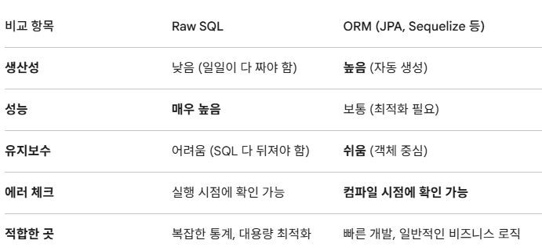

- 데이터베이스 정규화
    - 정규화(Normalization): 관계형 데이터베이스 설계에서 데이터의 중복을 최소화하고 데이터의 일관성을 유지하기 위해 테이블을 분해하는 과정
        - 한 테이블에 너무 많은 정보를 때려 박지 말고, 주제에 맞게 잘 쪼개서 관리하자
    - 정규화의 속성
    1. 제1정규형 (1NF): 모든 도메인이 원자 값이어야 한다. (한 속성이 두 개의 값을 가지는 것 불가)
    2. 제2정규형(2NF): 부분 함수 종속성을 제거한다. 즉, 기본키가 여러 개일 때(복합키), 일부 키에만 의존하는 속성이 있으면 안된다.
    3. 제3정규형(3NF): 이행 함수 종속성을 제거한다. A→B이고 B→C일 때, A→C가 성립하는 관계를 쪼개는 것이다. (예: 학번으로 학과를 알고, 학과로 학과 사무실 번호를 알 때 ‘학과 사무실 번호’를 분리)
    - 정규화의 장점
    1. 이상 현상(Anomaly) 해결: 데이터를 삽입, 수정, 삭제할 때 발생하는 논리적 오류를 막아준다.
        1. 삽입 이상(Insertion Anomaly): 데이터를 저장할 때, 원하지 않는 정보까지 억지로 입력해야 하거나, 특정 정보가 없어서 아예 데이터를 넣지 못하는 현상
        2. 갱신 이상(Update Anomaly): 중복된 데이터 중 일부만 수정되어 데이터의 불일치가 일어나는 현상
        3. 삭제 이상(Deletion Anomaly): 정보를 삭제할 때, 유지해야 할 다른 정보까지 연쇄적으로 삭제되는 현상
    2. 데이터 중복 최소화: 용량 절약
    3. 구조의 유연성: 새로운 데이터를 추가할 때 기존 구조를 덜 건드려도 돼서 확장성이 좋다
    4. 데이터 일관성 유지: 한 곳만 수정하면 연결된 모든 곳에 반영되니 데이터가 꼬일 일이 없다.
    - 정규화의 단점
    1. 조인 연산의 증가: 테이블을 너무 많이 쪼개면 데이터를 가져올 때마다 조인을 써야해서 성능 저하로 이어질 수 있다.
        
        → *반정규화로 성능 향상
        
        *반정규화: 데이터 무결성을 조금 포기하는 대신, 조회 속도를 높이는 트레이드 오프(Trade-off) 전략
        
    2. 쿼리의 복잡도: 조인이 여러번 달리면 코드가 복잡해지고 실수할 확률이 높아진다.
- 인덱스(Index)
    - 인덱스(Index): 데이터베이스 테이블의 검색 속도를 높이기 위해 사용하는 ‘색인’이다.
    - 인덱스의 속성
    1. B-Tree 구조: 대부분의 DB는 ‘B-Tree(Balanced Tree)’ 구조를 사용한다. 데이터를 정렬된 상태로 유지하며, 이진 탐색과 유사한 방식으로 빠르게 데이터를 찾아낸다.
    2. 별도의 저장 공간: 인덱스는 테이블과는 별도의 공간에 저장된다. 즉, 인덱스를 많이 만들면 그만큼 DB 용량을 추가로 사용하게 되는 것이다.
    3. 이진 탐색 활용: 데이터가 이미 정렬되어 있기 때문에, 처음부터 끝까지 다 뒤지는 Full Table Scan보다 효율적인 탐색이 가능하다.
    - 인덱스의 장점
    1. 검색 속도 향상(SELECT): 가장 큰 장점으로, 데이터가 수백만 건이 넘어가도 원하는 정보를 순식간에 찾아낼 수 있다.
    2. 시스템 부하 감소: DB가 데이터를 찾느라 CPU와 메모리를 과하게 쓰는 걸 막아줘서 전체적인 서비스 성능이 안정화된다.
    3. 정렬 및 그룹화 최적화: ORDER BY나 GROUP BY 연산을 할 때, 이미 인덱스로 정렬되어 있다면 DB가 추가 작업을 할 필요가 없어 훨씬 빨라진다.
    - 인덱스의 단점
    1. DML(INSERT, UPDATE, DELETE) 성능 저하: 데이터를 새로 넣거나 바꿀 때마다 인덱스도 같이 다시 정렬하고 수정해야 한다. 따라서 쓰기 작업이 잦은 테이블에 인덱스가 너무 많으면 오히려 느려진다.
    2. 저장 공간 차지: 인덱스 자체가 별도의 데이터라, 테이블 크기의 약 10% 정도 추가 공간이 필요하다.
    3. 관리가 필요함: 인덱스를 만들고 나서 데이터가 많이 변하면 인덱스 구조가 파편화될 수 있어 주기적인 관리가 필요하다.
    - 인덱스를 만들 때 중요한 것: 어떤 컬럼에 만들 것인가?
        - 추천: 데이터 중복도가 낮고(유니크한 값이 많고), WHERE 절이나 JOIN 조건에 자주 쓰이는 컬럼
        - 비추천: 성별처럼 ‘남/여’ 두 가지뿐인 컬럼(선택도가 낮은 컬럼)은 인덱스를 만들어도 DB가 안 쓰고 그냥 다 뒤지는 게 낫다고 판단할 수도 있다.
- ORM VS Raw SQL
    1. Raw SQL
    - 정의: 개발자가 데이터베이스에 전달할 명령어를 SQL 문법 그대로 직접 작성하는 방식이다.
    - 속성 및 특징
        - DB 종속성: MySQL, Oracle, PostgreSQL 등 DB마다 문법이 조금씩 달라서 DB를 바꾸면 쿼리도 다고쳐야할 수 있다.
        - 문자열 형태: 보통 코드 안에서 문자열 형태로 존재한다.
    - 장점
        - 성능: DB가 이해하는 언어로 직접 말하니까 중간 단계가 없어 가장 빠르다.
        - 세밀한 제어: 인덱스 활용이나 쿼리 최적화를 개발자가 100% 통제할 수 있다.
    - 단점
        - 가독성 저하: 코드 안에 SQL 문자열이 길게 들어가면 코드가 지저분해진다.
        - 컴파일 시 에러 체크 불가: 오타가 있어도 서버를 실행해서 쿼리를 날려보기 전까지는 틀린 걸 알기 어렵다.
    1. ORM (Object-Relational Mapping)
    - 정의: 객체와 관계형 데이터베이스의 데이터를 자동으로 매핑해주는 기술이다. DB 테이블을 자바나 파이썬의 클래스처럼 취급하겠다는 뜻이다.
    - 속성 및 특징
        - 객체 지향적: SQL을 몰라도 member.save()같은 메서드로 데이터를 넣을 수 있다.
        - 추상화: DB가 무엇인지 상관없이 또같은 코드로 동작하게 해 준다.
    - 장점
        - 생산성 폭발: 반복적인 CRUD(입력/조회/수정/삭제)를 메서드 호출 한 번으로 끝낼 수 있다.
        - 유지보수 용이: 테이블 구조가 바뀌면 클래스만 수정하면 돼서 관리가 편하다. 컴파일 시점에 에러를 잡아내기 좋다.
        - DBMS 독립성: MySQL 쓰다가 PostgreSQL로 바꿔도 설정 한 줄만 바꾸면 코드는 그대로 써도 된다.
    - 단점
        - 러닝 커브: JPA같은 건  제대로 쓰려면 공부할 게 정말 많다.(잘못 쓰면 성능 망함ㅠㅠ)
        - 성능 한계: 복잡한 쿼리는 ORM이 만들어내는 SQL이 비효율적일 수 있다. ‘N+1 문제’ 같은 고질적인 성능 이슈도 조심해야 한다.\
        
        
        
- (궁금해서 찾아본 것 ) N+1 문제
    - 정의: 연관 관계가 설정된 엔티티를 조회할 때, 데이터 1건을 가져오려고 쿼리를 날렸는데 연관된 데이터를 가져오기 위해 추가로 N번의 쿼리가 더 실행되는 현상. 즉, 내가 원한 건 쿼리 1번이었는데, 실제로는 1+N번이나 DB를 두드리는 비효율의 끝판왕이다.
        - 예시 상황, 앱에서 내가 작성한 리뷰 10개를 마이페이지에 띄운다고 가정
        1. 첫 번째 쿼리 (1): “내가 쓴 리뷰 10개 다 가져와”
        
        ```sql
        SELECT * FROM review WHERE member_id = :me LIMIT 10;
        ```
        
        - 리뷰 10개가 잘 왔지만 리뷰 안에 store_id만 있고 가게 이름이 없다.
        1. 추가 쿼리 (N): 리뷰 10개를 화면에 그리려다 보니 가게 이름이 필요함
        - 1번째 리뷰부터 10번째 리뷰 가게 이름 조회
        
        ⇒ 리뷰 목록 한 번 보려고 했을 뿐인데 DB 서버는 총 11번(1+10)이나 일을 하게 된 것이다. 만약 리뷰가 100개라면 쿼리가 101번 날아가게 된다.
        
    - 원인: ORM의 지연 로딩 방식 때문에 발생한다.
        - ORM은 일단 리뷰만 먼저 가져오고, 가게 정보는 실제로 쓰일 때(화면에 그릴 때) 그때그때 DB에 물어본다.
        - 나중에 필요할 때 주겠다며 미뤄놨던 게, 막상 반복문을 돌리면서 하나씩 꺼내 쓰려니 쿼리가 폭발하는 것이다.
    - 해결책: 처음부터 한꺼번에 다 가져오라고 시킨다.
    1. Fetch Join(가장 많이 씀): SQL의 JOIN을 써서 리뷰를 가져올 때 가게 정보까지 한 번에 묶어서 가져오는 방식이다. 쿼리 1번으로 끝낼 수 있다.
    2. Entity Graph: 어떤 연관 데이터를 한 번에 가져올지 미리 설정해 두는 것이다.
    3. Batch Size 설정: 가게 정보를 가져올 때 1개씩 말고, 100개씩 묶어서 가져오라고 설정하면 쿼리 횟수를 획기적으로 줄일 수 있다.