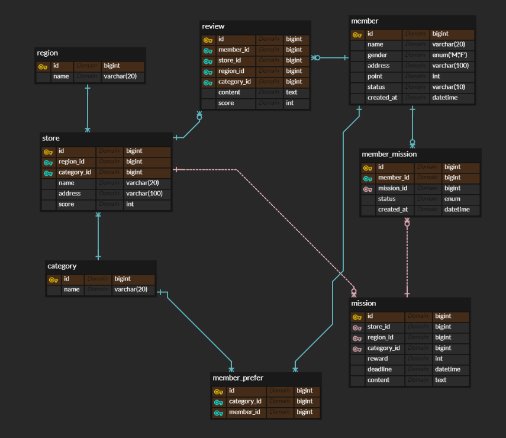
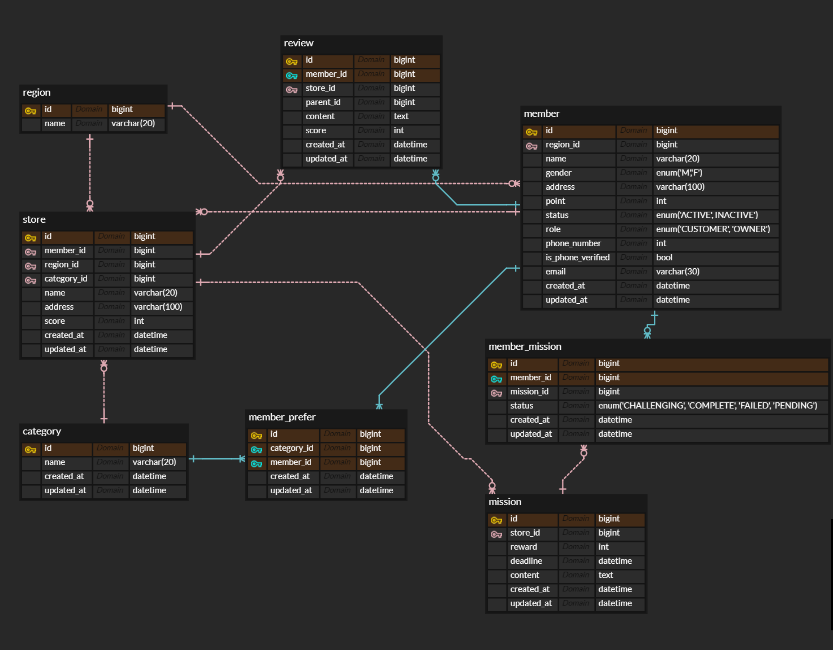

- 1주차 ERD 리뷰 후 수정본


#### 1. 내가 진행중, 진행 완료한 미션 모아서 보는 쿼리


- 쿼리 빌딩 순서
    
    1단계: "누가 주인공인가?" (FROM 선정)
    가장 먼저 "내가 뽑으려는 데이터의 핵심이 들어있는 테이블"이 무엇인지 정해야 한다.
    
    2단계: "누구의 도움(정보)이 더 필요한가?" (JOIN 추가)
    주인공 테이블만으로는 부족한 정보(미션 내용, 가게 이름 등)를 가져오기 위해 옆 테이블을 붙인다.
    
    3단계: "누구꺼, 어떤 것만 볼 것인가?" (WHERE 필터링)
    가장 중요한 단계, 여기서 실수하면 전 국민의 데이터가 다 나옵니다.
    필수 체크1: "로그인한 '나'의 데이터인가?"
    필수 체크2: "진행 중(CHALLENGING)인 것만 볼 것인가?"
    필수 체크3(페이징): "지난번에 본 것 다음부터 볼 것인가?"
    
    4단계: "어떤 순서로 보여줄 것인가?" (ORDER BY)
    사용자가 보기에 가장 편한 순서를 정한다. 보통 최신순.
    작성: ORDER BY m_ms.created_at DESC, m_ms.id DESC
    중복 대비를 위해 (날짜, PK) 세트로 정렬
    
    5단계: "그래서 화면에 뭘 내보낼까?" (SELECT 선택)
    마지막으로 화면에 뿌려줄 컬럼들만 골라 담는다. 처음부터 SELECT *로 시작하지 말고, 제일 마지막에 필요한 것만 적는 게 실수를 줄일 수 있다.
    
- status 컬럼의 enum 요소
    
    
    
- 진행중인 미션
    - 진행중인 미션 페이지(CHALLENGING)
        1. FROM, 누가 주인공이지?: member_mission
        2. JOIN, 누구의 정보가 더 필요한가?: 보상, 미션 내용, 가게 이름이 필요하니까 mission, store 테이블의 조인이 필요하겠다.
        3. WHERE, 누구꺼,어떤 것만 볼 것인가?: 로그인한 '나'의 데이터, 진행 중인 것, 지난번에 본 것 다음부터
        4. ORDER BY, 어떤 순서로 보여줄 것인가?: 최신순
        5. SELECT, 화면엔 뭘 내보낼까?: reward, content, status
        
        ```sql
        SELECT s.name AS store_name,
            ms.reward AS reward,
            ms.content AS mission_content,
            m_ms.status AS status,
            -- 페이징을 위한 커서값 (시간+ID 조합)
            CONCAT(LPAD(UNIX_TIMESTAMP(m_ms.created_at), 10, '0'), LPAD(m_ms.id, 10, '0')) AS cursor_value
        
        FROM member_mission m_ms
        JOIN member ms ON m_ms.mission_id = ms.id
        JOIN store s ON ms.store_id = s.id
        
        WHERE m_ms.member_id = :memberId
        	AND m_ms.status = 'CHALLENGING'
            AND CONCAT(LPAD(UNIX_TIMESTAMP(m_ms.created_at), 10, '0'), LPAD(m_ms.id, 10, '0')) < :lastCursor
            
        ORDER BY m_ms.created_at DESC, m_ms id DESC
        
        LIMIT 10
        ```
        
        - :memberId가 뭐지?(WHERE절 참고)
            - 플레이스홀더(Placeholder), 나중에 진짜 값이 들어갈 자리를 미리 맡아두는 예약석 같은 임시 변수
            - 왜 쓰지?
                1. 재사용성: 쿼리문 자체는 변하지 않고 안에 들어가는 값만 바뀌는 것
                2. 가독성: 그냥 ?라고 써두면 "이게 뭐였지?"싶을 때가 있는데, :memberId라고 써두면 "아, 여기엔 회원 ID가 들어가는구나!"라고 바로알 수 있다.
                3. 보안(SQL Injection 방지): DB가 이 자리에 들어오는 애는 "무조건 값(Data)"으로만 취급하게 강제해서, 해커들이 명령어를 심는 걸 원천 봉쇄한다.
- 진행 완료한 미션
    
    진행 중인 미션과 비슷하지만 status 조건을 COMPLETE로 걸어야하고, 미션이 완료된 순으로 보여주는 게 더 자연스러우니 정렬 기준을 updated_at으로 선택
    
    ```sql
    SELECT
    	s.name AS store_name,
        ms.reward AS reward,
        ms.content AS mission_content,
        mm.status AS status,
        -- 커서 값 생성
        CONCAT(LPAD(UNIX_TIMESTAMP(mm.updated_at), 10, '0'), LPAD(mm.id, 10, '0')) AS cursor_value
    FROM member_mission mm
    JOIN mission ms ON mm.mission_id = ms.id
    JOIN store s ON ms.store_id = s.id
    WHERE mm.member_id = :memberId
    	AND mm.status = 'COMPLETE'
        -- 커서 기반 페이징, updated_at 기준으로
        AND CONCAT(LPAD(UNIX_TIMESTAMP(mm.updated_at), 10, '0'), LPAD(mm.id, 10, '0')) < :lastCursor
    ORDER BY mm.updated_at DESC, mm.id DESC
    LIMIT 10;
    ```
    

#### 2. 리뷰 작성하는 쿼리


- 사장으로 로그인 한 경우
    - 답글은 가게 사장님만 달 수 있어야함 → member 테이블에서 사장과 고객을 구분하는 컬럼 추가 (ERD 수정사항 토글 참고)
    - 화면에 출력할 요소: 사용자 닉네임, 별점, 리뷰 내용, 날짜, 사장님 답글
    1. FROM, 누가 주인공이지?: review 테이블
    2. JOIN, 추가로 어떤 정보가 필요하지?: member 테이블
    3. WHERE, 어떤 조건만 볼건가?: 사장님으로 로그인한 경우 내 가게의 리뷰만(review.store_id=:myStoreId)
    4. ORDER BY: 미답변 리뷰부터 정렬 후 작성순으로 정렬
    5. SELECT: 멤버 이름, 리뷰 별점, 리뷰 내용, 등록 날짜(created_at), 사장님 답글
    - 가게에 달린 리뷰들을 정렬해서 보여주는 조회 쿼리
    
    ```sql
    -- 5. SELECT: 고객 정보와 리뷰 내용, 사장님 답글
    SELECT
    	m.name AS customer_name,
        r.score AS score,
        r.content AS review_content,
        r.created_at AS review_date,
        reply.content AS owner_reply --사장님 답글
    
    --1&2. FROM & JOIN: 리뷰(r)와 답글(reply)을 셀프 조인
    FROM review r
    --탈퇴한 회원이 쓴 리뷰가 있을 경우, 작성자 정보가 없더라도 리뷰는 보여줌
    LEFT JOIN member m ON r.member_id = m.id
    --LEFT JOIN을 써야 답글이 아직 없는 리뷰도 화면에 나온다
    LEFT JOIN review reply ON r.id = reply.parent_id
    
    --3. WHERE: 우리 가게의 원본 리뷰들만 가져오기
    WHERE r.store_id = :myStoreId
    	AND r.parent_id IS NULL
    
    --4. ORDER BY: 최신순 정렬
    ORDER BY 
    	(reply.id IS NULL) DESC,
    	r.created_at DESC;
    ```
    
    - 사장님 답글 작성(INSERT) 쿼리
    
    ```sql
    INSERT INTO review(
    	member_id, -- 답글을 쓰는 사장님의 ID
        store_id, -- 사장님 가게의 ID
        content, -- 답글 내용 ("정성스러운 리뷰 감사합니다!")
        score, -- 사장님 답글엔 별점이 없으니  NULL
        parent_id, -- 답글을 달 대상인 '고객 리뷰의 ID'
        created_at,
        updated_at
    )
    VALUES (
    	:ownerId,
        :storeId,
        :replyContent,
        NULL,
        :targetReviewId, -- 고객이 쓴 리뷰의 PK값
        NOW(),
        NOW(),
    )
    ```
    
    - review 테이블에서 region_id, category_id 삭제
- 고객으로 로그인 한 경우
    
    사장의 경우 리뷰 미작성 댓글을 우선 정렬하지만, 고객의 경우 작성순으로 정렬한다.
    ORDER BY 문만 수정됨.
    
    - 리뷰 조회 쿼리
    
    ```sql
    -- 5. SELECT: 고객 정보와 리뷰 내용, 사장님 답글
    SELECT
    	m.name AS customer_name,
        r.score AS score,
        r.content AS review_content,
        r.created_at AS review_date,
        reply.content AS owner_reply --사장님 답글
    
    --1&2. FROM & JOIN: 리뷰(r)와 답글(reply)을 셀프 조인
    FROM review r
    --탈퇴한 회원이 쓴 리뷰가 있을 경우, 작성자 정보가 없더라도 리뷰는 보여줌
    LEFT JOIN member m ON r.member_id = m.id
    --LEFT JOIN을 써야 답글이 아직 없는 리뷰도 화면에 나온다
    LEFT JOIN review reply ON r.id = reply.parent_id
    
    --3. WHERE: 우리 가게의 원본 리뷰들만 가져오기
    WHERE member_id = :myStoreId
    	AND r.parent_id IS NULL
    
    --4. ORDER BY: 최신순 정렬
    ORDER BY r.created_at DESC;
    ```
    
    - 리뷰 작성 쿼리
    
    ```sql
    INSERT INTO review (
    	member_id, --리뷰를 쓰는 고객의 ID
        store_id, --어느 가게에 쓰는지 (가게 ID)
        content, --"여기 진짜 맛있어요~"
        score, --별점
        parent_id, --새 리뷰니까 여긴 무조건 NULL
        created_at,
        updated_at
    )
    VALUES (
    	:customerId,
        :storeId,
        :reviewContent,
        :reviewScore,
        NULL,
        NOW(),
        NOW()
    );
    ```
    
- 사장&고객 공용 동적 조회 쿼리
    - 조회 쿼리에서 ORDER BY절만 바뀌는데 분리하는 게 비효율적인 것 같아 동적으로 작성
    
    ```sql
    SELECT 
        m.name AS customer_name,
        r.score AS score,
        r.content AS review_content,
        r.created_at AS review_date,
        reply.content AS owner_reply 
    FROM review r
    -- 탈퇴 회원 배려를 위한 LEFT JOIN 
    LEFT JOIN member m ON r.member_id = m.id
    -- 답글 없는 리뷰도 보여줘야 하니까 LEFT JOIN
    LEFT JOIN review reply ON r.id = reply.parent_id 
    WHERE r.store_id = :myStoreId 
      AND r.parent_id IS NULL 
    ORDER BY 
        -- 1순위: 사장님일 때만 미답변 리뷰를 위로 올림
        (CASE WHEN :userRole = 'OWNER' THEN (reply.id IS NULL) END) DESC, 
        -- 2순위: 공통적으로 최신 등록순 정렬
        r.created_at DESC;
    ```
    
- ERD 수정사항
    1. 회원 구분: member 테이블에 role 컬럼 추가, ENUM('CUSTOMER','OWNER')
    2. 가게 주인 연결: store 테이블에 member_id 컬럼 추가, 나중에 사장님이 로그인했을 때, 내 ID랑 이 가게에 등록된 member_id가 같은지 체크하면 됨
    3. 사장님 답글 기능: review 테이블에 parent_id 컬럼 추가->자기 참조 사용.(고객이 처음 리뷰를 쓰면 parent_id는 NULL, 사장님이 그 리뷰에 답글을 달면 parent_id에 그 고객 리뷰의 ID 삽입)
    4. review 테이블에서 region_id, category_id 삭제

#### 3. 홈 화면 쿼리 (현재 선택 된 지역에서 도전이 가능한 미션 목록, 페이징 포함)


- 무엇을 출력해야될까?: 미션 진행 현황(status가 'COMPLETE'인 개수), 선택된 지역(region)에서 도전 가능한 미션 목록
    - 상단 미션 진행 현황과 하단 도전 가능 미션을 분리하여 작성
- 상단(미션 진행 상황)
    - 보여줘야하는 정보: 선택된 지역에서 수행된 미션 현황
    1.FROM: region
    2.JOIN: store, mission, member_mission
    3.WHERE: 현재 지역에 해당하는 데이터만
    4.SELECT: 지역 이름, 완료한 미션 개수
    
    ```sql
    SELECT
    	r.name AS region_name,
        COUNT(CASE WHEN mm.status = 'COMPLETE' THEN 1 END) AS completed_count
    
    FROM region r
    JOIN store s ON s.region_id=r.id
    JOIN mission m ON m.store_id=s.id
    LEFT JOIN member_mission mm ON mm.mission_id=m.id
    	AND mm.member_id = :memberId
        AND mm.status = 'COMPLETE'
        
    GROUP BY r.id, r.name
    
    ORDER BY r.name ASC;
    ```
    
- 하단(도전 가능 미션 목록)
    - 무엇을 출력해야 할까?: 선택된 지역에 도전 가능한 미션 목록, 이미 완료된 미션은 제외
    1.FROM: mission
    2.JOIN: store, category
    3.WHERE: 선택된 지역에 해당하는 진행 전 미션을 보여준다
    4.ORDER BY: mission.deadline asc 마감기한이 짧게 남은걸 먼저 보여줌
    5.SELECT: 가게이름, 카테고리, 미션 내용, 보상
    
    ```sql
    SELECT s.name AS store_name,
    	c.name AS category_name,
        m.content AS mission_content,
        m.reward AS mission_reward,
        m.deadline,
        m.id
    
    FROM mission m
    JOIN store s ON m.store_id=s.id
    JOIN category c ON s.category_id=c.id
    
    WHERE s.region_id = :selectedRegionId
    	AND m.status = 'ACTIVE'
        --1. 완료 미션 제외 로직
        AND NOT EXISTS (
        	SELECT 1 FROM member_mission mm
            WHERE mm.mission id = m.id AND mm.member_id = :memberId AND mm.status ='COMPLETE'
        )
        --2. 커서 로직 추가(첫 페이지 요청 시에는 이 조건 제외)
        AND (m.deadline > :lastDeadline OR (m.deadline = :lastDeadline AND m.id > :lastId))
    ORDER BY m.deadline ASC, m.id ASC
    LIMIT :size;
    ```
    
    - 고민한 부분
    : 마감 기한이 짧은 순으로 정렬을 했을 때, 사용자 입장에서 마감 기한이 더 긴 미션을 찾고 싶으면 점프가 가능한 오프셋 기반 페이징이 UX를 더 매끄럽게 해주지 않을까?
    → 서비스의 성격에 따라 결정해야함. 인스타, 당근, 맛집 리스트처럼냥 슥슥 내리면 발견하는 게 목적일 때 커서 방식이 유리하다. 특정 위치를 찾는 기능이 필요하다면 마감 임박 순, 마감 널널한 순, 보상 높은 순으로 정렬 방식을 선택할 수 있게 하거나 검색 기능을 추가해준다. 또 카테고리 필터를 넣어줘도 사용자가 원하는 걸 훨씬 빨리 찾을 수 있다.
- ERD 수정
    - member 테이블과 region 테이블 연관관계 설정
    - member 테이블의 status enum(’ACTIVE’,’INACTIVE’)로 구성

#### 4. 마이 페이지 화면 쿼리


- 무엇을 보여줘야 할까?: 이름, 이메일, 휴대폰 번호, 휴대폰 번호 인증 여부, 포인트

1.FROM: member
2.WHERE: 내 아이디에 해당하는 정보만
3.SELECT: m.name, m.emial, m.phone_number, m.point, is_phone_verified
-ERD 수정: 휴대폰 번호 추가(NULL 허용), 번호 인증 추가, 이메일 추가

```sql
SELECT m.name,
	m.email,
    IFNULL(m.phone_number, '미인증') AS phone_display,
    m.is_phone_verified AS verified,
    m.point
    
FROM member m

WHERE m.id = :memberId
```

- 수정된 ERD
