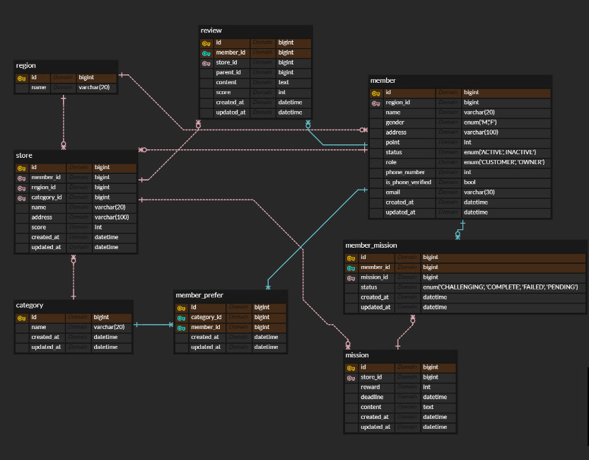
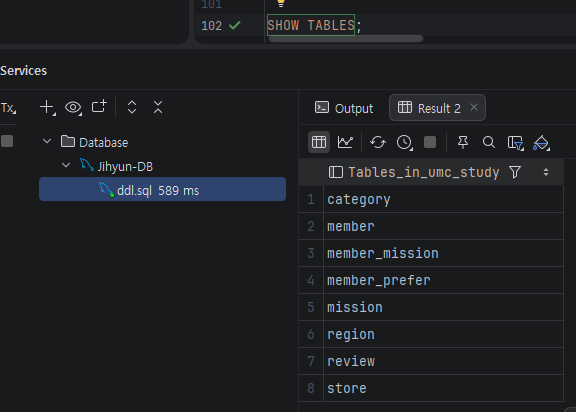

- ERD

- 데이터베이스 생성 및 선택

```sql
CREATE DATABASE umc_study;
USE umc_study;
```

- region 테이블 생성

```sql
CREATE TABLE region (
    id BIGINT PRIMARY KEY AUTO_INCREMENT,
    name VARCHAR(20) NOT NULL
);
```

- category 테이블 생성

```sql
CREATE TABLE category (
    id BIGINT PRIMARY KEY AUTO_INCREMENT,
    name VARCHAR(20) NOT NULL,
    created_at DATETIME DEFAULT CURRENT_TIMESTAMP,
    updated_at DATETIME DEFAULT CURRENT_TIMESTAMP ON UPDATE CURRENT_TIMESTAMP
);
```

- member 테이블 생성

```sql
CREATE TABLE member (
    id BIGINT PRIMARY KEY AUTO_INCREMENT,
    region_id BIGINT,
    name VARCHAR(20) NOT NULL,
    gender ENUM('M', 'F'),
    address VARCHAR(100),
    point INT DEFAULT 0,
    status ENUM('ACTIVE', 'INACTIVE') DEFAULT 'ACTIVE',
    role ENUM('CUSTOMER', 'OWNER') DEFAULT 'CUSTOMER',
    phone_number INT, -- ERD 기반이나 실제로는 VARCHAR(15) 권장
    is_phone_verified BOOLEAN DEFAULT FALSE,
    email VARCHAR(30) UNIQUE NOT NULL,
    created_at DATETIME DEFAULT CURRENT_TIMESTAMP,
    updated_at DATETIME DEFAULT CURRENT_TIMESTAMP ON UPDATE CURRENT_TIMESTAMP,
    FOREIGN KEY (region_id) REFERENCES region(id)
);
```

- store 테이블 생성

```sql
CREATE TABLE store (
    id BIGINT PRIMARY KEY AUTO_INCREMENT,
    member_id BIGINT, -- 사장님
    region_id BIGINT,
    category_id BIGINT,
    name VARCHAR(20) NOT NULL,
    address VARCHAR(100),
    score INT DEFAULT 0,
    created_at DATETIME DEFAULT CURRENT_TIMESTAMP,
    updated_at DATETIME DEFAULT CURRENT_TIMESTAMP ON UPDATE CURRENT_TIMESTAMP,
    FOREIGN KEY (member_id) REFERENCES member(id),
    FOREIGN KEY (region_id) REFERENCES region(id),
    FOREIGN KEY (category_id) REFERENCES category(id)
);
```

- review 테이블 생성

```sql
CREATE TABLE review (
    id BIGINT PRIMARY KEY AUTO_INCREMENT,
    member_id BIGINT,
    store_id BIGINT,
    parent_id BIGINT, -- 대댓글용
    content TEXT,
    score INT,
    created_at DATETIME DEFAULT CURRENT_TIMESTAMP,
    updated_at DATETIME DEFAULT CURRENT_TIMESTAMP ON UPDATE CURRENT_TIMESTAMP,
    FOREIGN KEY (member_id) REFERENCES member(id),
    FOREIGN KEY (store_id) REFERENCES store(id)
);
```

- mission 테이블 생성

```sql
CREATE TABLE mission (
    id BIGINT PRIMARY KEY AUTO_INCREMENT,
    store_id BIGINT,
    reward INT,
    deadline DATETIME,
    content TEXT,
    created_at DATETIME DEFAULT CURRENT_TIMESTAMP,
    updated_at DATETIME DEFAULT CURRENT_TIMESTAMP ON UPDATE CURRENT_TIMESTAMP,
    FOREIGN KEY (store_id) REFERENCES store(id)
);
```

- member_mission 테이블 생성

```sql
CREATE TABLE member_mission (
    id BIGINT PRIMARY KEY AUTO_INCREMENT,
    member_id BIGINT,
    mission_id BIGINT,
    status ENUM('CHALLENGING', 'COMPLETE', 'FAILED', 'PENDING') DEFAULT 'CHALLENGING',
    created_at DATETIME DEFAULT CURRENT_TIMESTAMP,
    updated_at DATETIME DEFAULT CURRENT_TIMESTAMP ON UPDATE CURRENT_TIMESTAMP,
    FOREIGN KEY (member_id) REFERENCES member(id),
    FOREIGN KEY (mission_id) REFERENCES mission(id)
);
```

- member_prefer 테이블 생성

```sql
CREATE TABLE member_prefer (
    id BIGINT PRIMARY KEY AUTO_INCREMENT,
    category_id BIGINT,
    member_id BIGINT,
    created_at DATETIME DEFAULT CURRENT_TIMESTAMP,
    updated_at DATETIME DEFAULT CURRENT_TIMESTAMP ON UPDATE CURRENT_TIMESTAMP,
    FOREIGN KEY (category_id) REFERENCES category(id),
    FOREIGN KEY (member_id) REFERENCES member(id)
);
```

- SHOW TABLES; 결과

